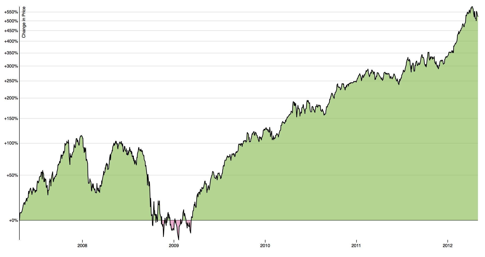

# PercentageChange

* [PercentageChange](https://bl.ocks.org/mbostock/978f6c03c9aab8af8594)

## Attributes

| Name          | Default | Type       | Description       |
| ------------- | ------- | ---------- | ----------------- |
| id            | null    | String     | Unique identifier of the component.
| rendered      | true    | Boolean    | Boolean value to specify the rendering of the component, when set to false component will not be rendered.
| style         | null    | String     | Inline style of the component.
| styleClass    | null    | String     | Style class of the component.
| widgetVar     | null    | String     | Name of the client side widget.
| width         | auto    | String     | Width of the component.
| height        | auto    | String     | Height of the component.
| url           | null    | String     | JSON data from url.


## Getting Started

```xml
<d3:percentagechange/>
```

## Screenshot


